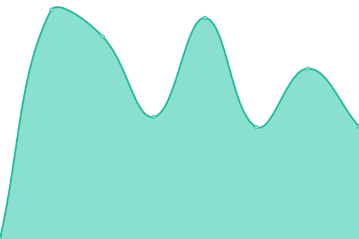
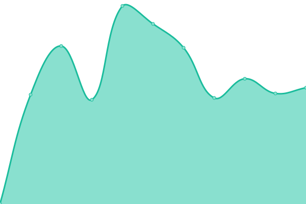

# [📈 Live Status](https://upptime.github.io/upptime): <!--live status--> **🟩 All systems operational**

This repository contains the open-source uptime monitor and status page for [Upptime](https://upptime.js.org), powered by [Upptime](https://github.com/upptime/upptime).

With [Upptime](https://upptime.js.org), you can get your own unlimited and free uptime monitor and status page, powered entirely by a GitHub repository. We use [Issues](https://github.com/upptime/upptime/issues) as incident reports, [Actions](https://github.com/gnc178/congenial-couscous/actions) as uptime monitors, and [Pages](https://upptime.github.io/upptime) for the status page.

<!--start: status pages-->
<!-- This summary is generated by Upptime (https://github.com/upptime/upptime) -->
<!-- Do not edit this manually, your changes will be overwritten -->
<!-- prettier-ignore -->
| URL | Status | History | Response Time | Uptime |
| --- | ------ | ------- | ------------- | ------ |
|  [API](https://api.callibri.ru) | 🟩 Up | [api.yml](https://github.com/gnc178/congenial-couscous/commits/HEAD/history/api.yml) | 

 1001ms
     
 | 

<a href="https://gnc178.github.io/congenial-couscous/history/api">100.00%</a>
    

|  [Landing](https://callibri.ru) | 🟩 Up | [landing.yml](https://github.com/gnc178/congenial-couscous/commits/HEAD/history/landing.yml) | 

 2271ms
     
 | 

<a href="https://gnc178.github.io/congenial-couscous/history/landing">100.00%</a>
    

|  [Cabinet](https://in.callibri.ru) | 🟩 Up | [cabinet.yml](https://github.com/gnc178/congenial-couscous/commits/HEAD/history/cabinet.yml) | 

 1651ms
     
 | 

<a href="https://gnc178.github.io/congenial-couscous/history/cabinet">100.00%</a>
    

|  [Sync](https://externalcrm.callibri.ru) | 🟩 Up | [sync.yml](https://github.com/gnc178/congenial-couscous/commits/HEAD/history/sync.yml) | 

 942ms
     
 | 

<a href="https://gnc178.github.io/congenial-couscous/history/sync">100.00%</a>
    

|  [Skvan](https://skvan.callibri.ru) | 🟩 Up | [skvan.yml](https://github.com/gnc178/congenial-couscous/commits/HEAD/history/skvan.yml) | 

 834ms
     
 | 

<a href="https://gnc178.github.io/congenial-couscous/history/skvan">100.00%</a>
    

|  [Gudok](https://gudok.tel) | 🟩 Up | [gudok.yml](https://github.com/gnc178/congenial-couscous/commits/HEAD/history/gudok.yml) | 

 2019ms
     
 | 

<a href="https://gnc178.github.io/congenial-couscous/history/gudok">100.00%</a>
    

|  [PopUp](https://catchers.callibri.ru) | 🟩 Up | [pop-up.yml](https://github.com/gnc178/congenial-couscous/commits/HEAD/history/pop-up.yml) | 

 766ms
     
 | 

<a href="https://gnc178.github.io/congenial-couscous/history/pop-up">100.00%</a>
    

<!--end: status pages-->

[**Visit our status website →**](https://upptime.github.io/upptime)

## 📄 License

- Powered by: [Upptime](https://github.com/upptime/upptime)
- Code: [MIT](./LICENSE) © [Anand Chowdhary](https://anandchowdhary.com), supported by [Pabio](https://pabio.com)
- Data in the `./history` directory: [Open Database License](https://opendatacommons.org/licenses/odbl/1-0/)
