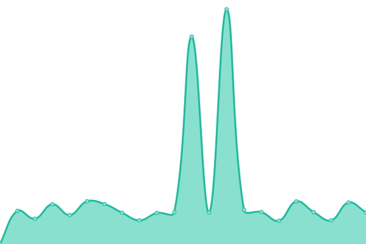

# [📈 Live Status](https://upptime.github.io/upptime): <!--live status--> **🟩 All systems operational**

This repository contains the open-source uptime monitor and status page for [Upptime](https://upptime.js.org), powered by [Upptime](https://github.com/upptime/upptime).

With [Upptime](https://upptime.js.org), you can get your own unlimited and free uptime monitor and status page, powered entirely by a GitHub repository. We use [Issues](https://github.com/upptime/upptime/issues) as incident reports, [Actions](https://github.com/gnc178/congenial-couscous/actions) as uptime monitors, and [Pages](https://upptime.github.io/upptime) for the status page.

<!--start: status pages-->
<!-- This summary is generated by Upptime (https://github.com/upptime/upptime) -->
<!-- Do not edit this manually, your changes will be overwritten -->
<!-- prettier-ignore -->
| URL | Status | History | Response Time | Uptime |
| --- | ------ | ------- | ------------- | ------ |
|  [API](https://api.callibri.ru) | 🟩 Up | [api.yml](https://github.com/gnc178/congenial-couscous/commits/HEAD/history/api.yml) | 

 1010ms
     
 | 

<a href="https://gnc178.github.io/congenial-couscous/history/api">99.76%</a>
    

|  [Landing](https://callibri.ru) | 🟩 Up | [landing.yml](https://github.com/gnc178/congenial-couscous/commits/HEAD/history/landing.yml) | 

 1807ms
     
 | 

<a href="https://gnc178.github.io/congenial-couscous/history/landing">100.00%</a>
    

|  [Cabinet](https://in.callibri.ru) | 🟩 Up | [cabinet.yml](https://github.com/gnc178/congenial-couscous/commits/HEAD/history/cabinet.yml) | 

 1375ms
     
 | 

<a href="https://gnc178.github.io/congenial-couscous/history/cabinet">99.76%</a>
    

|  [Sync](https://externalcrm.callibri.ru) | 🟩 Up | [sync.yml](https://github.com/gnc178/congenial-couscous/commits/HEAD/history/sync.yml) | 

 982ms
     
 | 

<a href="https://gnc178.github.io/congenial-couscous/history/sync">100.00%</a>
    

|  [Skvan](https://skvan.callibri.ru) | 🟩 Up | [skvan.yml](https://github.com/gnc178/congenial-couscous/commits/HEAD/history/skvan.yml) | 

 1016ms
     
 | 

<a href="https://gnc178.github.io/congenial-couscous/history/skvan">100.00%</a>
    

|  [Gudok Landing](https://gudok.tel) | 🟩 Up | [gudok-landing.yml](https://github.com/gnc178/congenial-couscous/commits/HEAD/history/gudok-landing.yml) | 

 2564ms
     
 | 

<a href="https://gnc178.github.io/congenial-couscous/history/gudok-landing">99.77%</a>
    

|  [Gudok Cabinet](https://in.gudok.tel) | 🟩 Up | [gudok-cabinet.yml](https://github.com/gnc178/congenial-couscous/commits/HEAD/history/gudok-cabinet.yml) | 

 1303ms
     
 | 

<a href="https://gnc178.github.io/congenial-couscous/history/gudok-cabinet">99.77%</a>
    

|  [PopUp](https://catchers.callibri.ru) | 🟩 Up | [pop-up.yml](https://github.com/gnc178/congenial-couscous/commits/HEAD/history/pop-up.yml) | 

 2868ms
     
 | 

<a href="https://gnc178.github.io/congenial-couscous/history/pop-up">99.74%</a>
    

|  [Mapi](https://mapi.callibri.ru) | 🟩 Up | [mapi.yml](https://github.com/gnc178/congenial-couscous/commits/HEAD/history/mapi.yml) | 

 1540ms
     
 | 

<a href="https://gnc178.github.io/congenial-couscous/history/mapi">100.00%</a>
    

|  [Chapi](http://chapi.callibri.ru) | 🟩 Up | [chapi.yml](https://github.com/gnc178/congenial-couscous/commits/HEAD/history/chapi.yml) | 

 1415ms
     
 | 

<a href="https://gnc178.github.io/congenial-couscous/history/chapi">99.86%</a>
    

|  [Module](https://module.callibri.ru) | 🟩 Up | [module.yml](https://github.com/gnc178/congenial-couscous/commits/HEAD/history/module.yml) | 

 1451ms
     
 | 

<a href="https://gnc178.github.io/congenial-couscous/history/module">100.00%</a>
    

|  [Blog](https://blog.callibri.ru) | 🟩 Up | [blog.yml](https://github.com/gnc178/congenial-couscous/commits/HEAD/history/blog.yml) | 

 2813ms
     
 | 

<a href="https://gnc178.github.io/congenial-couscous/history/blog">100.00%</a>
    

|  [Minimo](https://minimo.callibri.ru) | 🟩 Up | [minimo.yml](https://github.com/gnc178/congenial-couscous/commits/HEAD/history/minimo.yml) | 

 1346ms
     
 | 

<a href="https://gnc178.github.io/congenial-couscous/history/minimo">100.00%</a>
    

|  [Ws](https://ws.callibri.ru/) | 🟩 Up | [ws.yml](https://github.com/gnc178/congenial-couscous/commits/HEAD/history/ws.yml) | 

 767ms
     
 | 

<a href="https://gnc178.github.io/congenial-couscous/history/ws">99.87%</a>
    

|  [PWA](https://dialog.callibri.ru) | 🟩 Up | [pwa.yml](https://github.com/gnc178/congenial-couscous/commits/HEAD/history/pwa.yml) | 

 1147ms
     
 | 

<a href="https://gnc178.github.io/congenial-couscous/history/pwa">100.00%</a>
    

|  [Pong](https://pong.callibri.ru) | 🟩 Up | [pong.yml](https://github.com/gnc178/congenial-couscous/commits/HEAD/history/pong.yml) | 

 990ms
     
 | 

<a href="https://gnc178.github.io/congenial-couscous/history/pong">99.88%</a>
    

|  [Registry](https://registry.callibri.ru) | 🟩 Up | [registry.yml](https://github.com/gnc178/congenial-couscous/commits/HEAD/history/registry.yml) | 

 790ms
     
 | 

<a href="https://gnc178.github.io/congenial-couscous/history/registry">100.00%</a>
    

|  [2g.tel](https://2g.tel) | 🟩 Up | [2g-tel.yml](https://github.com/gnc178/congenial-couscous/commits/HEAD/history/2g-tel.yml) | 

 819ms
     
 | 

<a href="https://gnc178.github.io/congenial-couscous/history/2g-tel">100.00%</a>
    

|  [Brief](https://brief-media.ru) | 🟩 Up | [brief.yml](https://github.com/gnc178/congenial-couscous/commits/HEAD/history/brief.yml) | 

 2746ms
     
 | 

<a href="https://gnc178.github.io/congenial-couscous/history/brief">100.00%</a>
    

|  [SmartSms](https://smartsms.callibri.ru) | 🟩 Up | [smart-sms.yml](https://github.com/gnc178/congenial-couscous/commits/HEAD/history/smart-sms.yml) | 

 2059ms
     
 | 

<a href="https://gnc178.github.io/congenial-couscous/history/smart-sms">100.00%</a>
    

|  [Callibri CDN Script](https://cdn.callibri.ru/callibri.js) | 🟩 Up | [callibri-cdn-script.yml](https://github.com/gnc178/congenial-couscous/commits/HEAD/history/callibri-cdn-script.yml) | 

 1607ms
     
 | 

<a href="https://gnc178.github.io/congenial-couscous/history/callibri-cdn-script">100.00%</a>
    

|  [Gudok CDN Script](https://mod.gudok.tel/script.js) | 🟩 Up | [gudok-cdn-script.yml](https://github.com/gnc178/congenial-couscous/commits/HEAD/history/gudok-cdn-script.yml) | 

 786ms
     
 | 

<a href="https://gnc178.github.io/congenial-couscous/history/gudok-cdn-script">100.00%</a>
    

|  [Health](https://health.callibri.ru) | 🟩 Up | [health.yml](https://github.com/gnc178/congenial-couscous/commits/HEAD/history/health.yml) | 

 805ms
     
 | 

<a href="https://gnc178.github.io/congenial-couscous/history/health">100.00%</a>
    

<!--end: status pages-->

[**Visit our status website →**](https://upptime.github.io/upptime)

## 📄 License

- Powered by: [Upptime](https://github.com/upptime/upptime)
- Code: [MIT](./LICENSE) © [Anand Chowdhary](https://anandchowdhary.com), supported by [Pabio](https://pabio.com)
- Data in the `./history` directory: [Open Database License](https://opendatacommons.org/licenses/odbl/1-0/)
