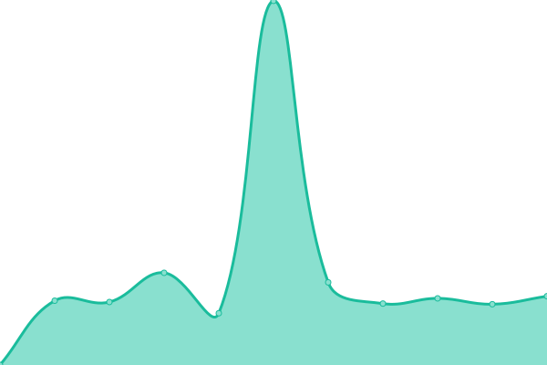

# [📈 Live Status](https://upptime.github.io/upptime): <!--live status--> **🟧 Partial outage**

This repository contains the open-source uptime monitor and status page for [Upptime](https://upptime.js.org), powered by [Upptime](https://github.com/upptime/upptime).

With [Upptime](https://upptime.js.org), you can get your own unlimited and free uptime monitor and status page, powered entirely by a GitHub repository. We use [Issues](https://github.com/upptime/upptime/issues) as incident reports, [Actions](https://github.com/gnc178/congenial-couscous/actions) as uptime monitors, and [Pages](https://upptime.github.io/upptime) for the status page.

<!--start: status pages-->
<!-- This summary is generated by Upptime (https://github.com/upptime/upptime) -->
<!-- Do not edit this manually, your changes will be overwritten -->
<!-- prettier-ignore -->
| URL | Status | History | Response Time | Uptime |
| --- | ------ | ------- | ------------- | ------ |
|  [API](https://api.callibri.ru) | 🟩 Up | [api.yml](https://github.com/gnc178/congenial-couscous/commits/HEAD/history/api.yml) | 

 1053ms
     
 | 

<a href="https://gnc178.github.io/congenial-couscous/history/api">99.17%</a>
    

|  [Landing](https://callibri.ru) | 🟩 Up | [landing.yml](https://github.com/gnc178/congenial-couscous/commits/HEAD/history/landing.yml) | 

 2107ms
     
 | 

<a href="https://gnc178.github.io/congenial-couscous/history/landing">99.85%</a>
    

|  [Cabinet](https://in.callibri.ru) | 🟩 Up | [cabinet.yml](https://github.com/gnc178/congenial-couscous/commits/HEAD/history/cabinet.yml) | 

 1626ms
     
 | 

<a href="https://gnc178.github.io/congenial-couscous/history/cabinet">98.65%</a>
    

|  [Sync](https://externalcrm.callibri.ru) | 🟩 Up | [sync.yml](https://github.com/gnc178/congenial-couscous/commits/HEAD/history/sync.yml) | 

 1126ms
     
 | 

<a href="https://gnc178.github.io/congenial-couscous/history/sync">99.64%</a>
    

|  [Skvan](https://skvan.callibri.ru) | 🟩 Up | [skvan.yml](https://github.com/gnc178/congenial-couscous/commits/HEAD/history/skvan.yml) | 

 1421ms
     
 | 

<a href="https://gnc178.github.io/congenial-couscous/history/skvan">99.49%</a>
    

|  [Gudok Landing](https://gudok.tel) | 🟩 Up | [gudok-landing.yml](https://github.com/gnc178/congenial-couscous/commits/HEAD/history/gudok-landing.yml) | 

 1238ms
     
 | 

<a href="https://gnc178.github.io/congenial-couscous/history/gudok-landing">100.00%</a>
    

|  [Gudok Cabinet](https://in.gudok.tel) | 🟩 Up | [gudok-cabinet.yml](https://github.com/gnc178/congenial-couscous/commits/HEAD/history/gudok-cabinet.yml) | 

 1870ms
     
 | 

<a href="https://gnc178.github.io/congenial-couscous/history/gudok-cabinet">99.32%</a>
    

|  [PopUp](https://catchers.callibri.ru) | 🟥 Down | [pop-up.yml](https://github.com/gnc178/congenial-couscous/commits/HEAD/history/pop-up.yml) | 

 2291ms
     
 | 

<a href="https://gnc178.github.io/congenial-couscous/history/pop-up">91.56%</a>
    

|  [Mapi](https://mapi.callibri.ru) | 🟥 Down | [mapi.yml](https://github.com/gnc178/congenial-couscous/commits/HEAD/history/mapi.yml) | 

 801ms
     
 | 

<a href="https://gnc178.github.io/congenial-couscous/history/mapi">99.30%</a>
    

|  [Chapi](http://chapi.callibri.ru) | 🟩 Up | [chapi.yml](https://github.com/gnc178/congenial-couscous/commits/HEAD/history/chapi.yml) | 

 585ms
     
 | 

<a href="https://gnc178.github.io/congenial-couscous/history/chapi">98.39%</a>
    

|  [Module](https://module.callibri.ru) | 🟩 Up | [module.yml](https://github.com/gnc178/congenial-couscous/commits/HEAD/history/module.yml) | 

 1080ms
     
 | 

<a href="https://gnc178.github.io/congenial-couscous/history/module">99.48%</a>
    

|  [Blog](https://blog.callibri.ru) | 🟩 Up | [blog.yml](https://github.com/gnc178/congenial-couscous/commits/HEAD/history/blog.yml) | 

 1921ms
     
 | 

<a href="https://gnc178.github.io/congenial-couscous/history/blog">99.45%</a>
    

|  [Minimo](https://minimo.callibri.ru) | 🟩 Up | [minimo.yml](https://github.com/gnc178/congenial-couscous/commits/HEAD/history/minimo.yml) | 

 759ms
     
 | 

<a href="https://gnc178.github.io/congenial-couscous/history/minimo">99.47%</a>
    

|  [Ws](https://ws.callibri.ru/) | 🟩 Up | [ws.yml](https://github.com/gnc178/congenial-couscous/commits/HEAD/history/ws.yml) | 

 1244ms
     
 | 

<a href="https://gnc178.github.io/congenial-couscous/history/ws">99.86%</a>
    

|  [PWA](https://dialog.callibri.ru) | 🟩 Up | [pwa.yml](https://github.com/gnc178/congenial-couscous/commits/HEAD/history/pwa.yml) | 

 1183ms
     
 | 

<a href="https://gnc178.github.io/congenial-couscous/history/pwa">99.74%</a>
    

|  [Pong](https://pong.callibri.ru) | 🟩 Up | [pong.yml](https://github.com/gnc178/congenial-couscous/commits/HEAD/history/pong.yml) | 

 1233ms
     
 | 

<a href="https://gnc178.github.io/congenial-couscous/history/pong">99.14%</a>
    

|  [Registry](https://registry.callibri.ru) | 🟩 Up | [registry.yml](https://github.com/gnc178/congenial-couscous/commits/HEAD/history/registry.yml) | 

 1037ms
     
 | 

<a href="https://gnc178.github.io/congenial-couscous/history/registry">98.73%</a>
    

|  [2g.tel](https://2g.tel) | 🟩 Up | [2g-tel.yml](https://github.com/gnc178/congenial-couscous/commits/HEAD/history/2g-tel.yml) | 

 813ms
     
 | 

<a href="https://gnc178.github.io/congenial-couscous/history/2g-tel">99.75%</a>
    

|  [SmartSms](https://smartsms.callibri.ru) | 🟩 Up | [smart-sms.yml](https://github.com/gnc178/congenial-couscous/commits/HEAD/history/smart-sms.yml) | 

 1105ms
     
 | 

<a href="https://gnc178.github.io/congenial-couscous/history/smart-sms">98.58%</a>
    

|  [Callibri CDN Script](https://cdn.callibri.ru/callibri.js) | 🟩 Up | [callibri-cdn-script.yml](https://github.com/gnc178/congenial-couscous/commits/HEAD/history/callibri-cdn-script.yml) | 

 2186ms
     
 | 

<a href="https://gnc178.github.io/congenial-couscous/history/callibri-cdn-script">100.00%</a>
    

|  [Gudok CDN Script](https://mod.gudok.tel/script.js) | 🟩 Up | [gudok-cdn-script.yml](https://github.com/gnc178/congenial-couscous/commits/HEAD/history/gudok-cdn-script.yml) | 

 1694ms
     
 | 

<a href="https://gnc178.github.io/congenial-couscous/history/gudok-cdn-script">99.45%</a>
    

|  [Health](https://health.callibri.ru) | 🟩 Up | [health.yml](https://github.com/gnc178/congenial-couscous/commits/HEAD/history/health.yml) | 

 1018ms
     
 | 

<a href="https://gnc178.github.io/congenial-couscous/history/health">98.41%</a>
    

|  [GitLab](https://code.callibri.ru) | 🟩 Up | [git-lab.yml](https://github.com/gnc178/congenial-couscous/commits/HEAD/history/git-lab.yml) | 

 1182ms
     
 | 

<a href="https://gnc178.github.io/congenial-couscous/history/git-lab">99.66%</a>
    

|  [Registry](https://registry.callibri.ru) | 🟩 Up | [registry.yml](https://github.com/gnc178/congenial-couscous/commits/HEAD/history/registry.yml) | 

 1037ms
     
 | 

<a href="https://gnc178.github.io/congenial-couscous/history/registry">98.73%</a>
    

<!--end: status pages-->

[**Visit our status website →**](https://upptime.github.io/upptime)

## 📄 License

- Powered by: [Upptime](https://github.com/upptime/upptime)
- Code: [MIT](./LICENSE) © [Anand Chowdhary](https://anandchowdhary.com), supported by [Pabio](https://pabio.com)
- Data in the `./history` directory: [Open Database License](https://opendatacommons.org/licenses/odbl/1-0/)
